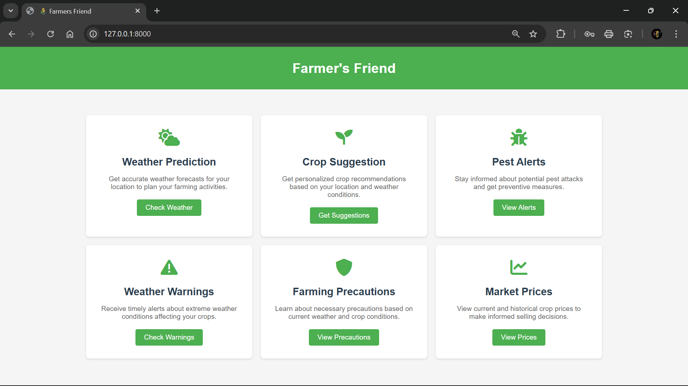
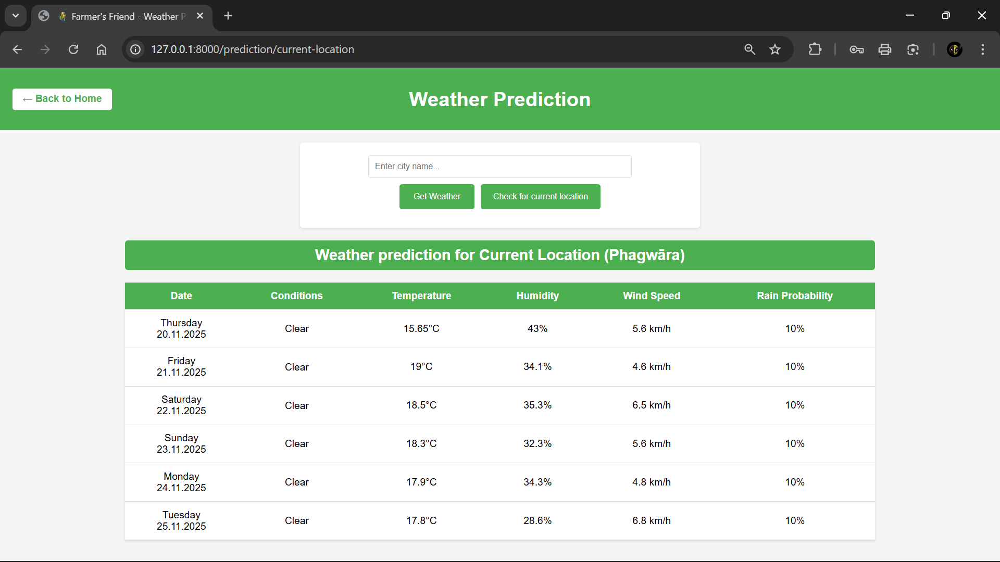
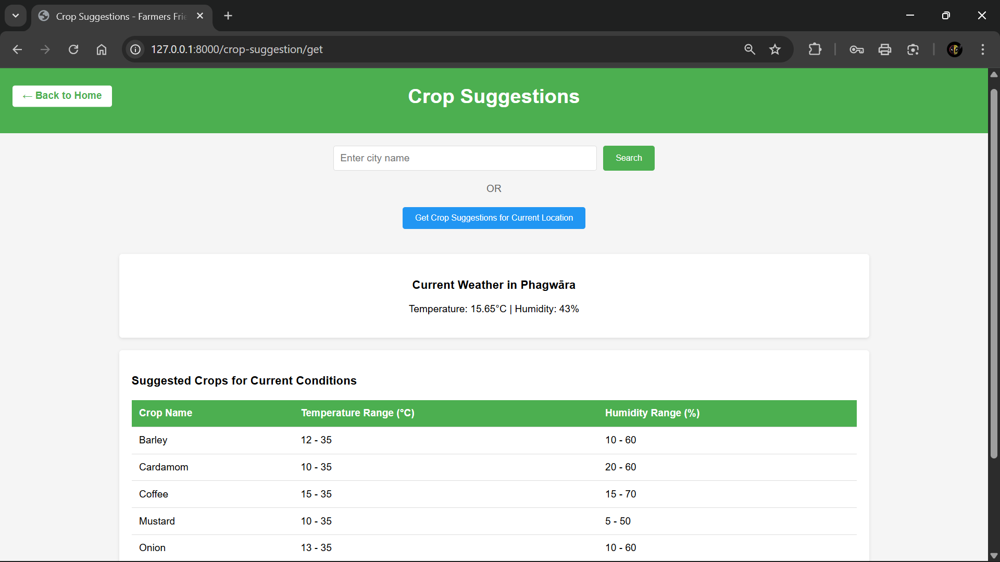
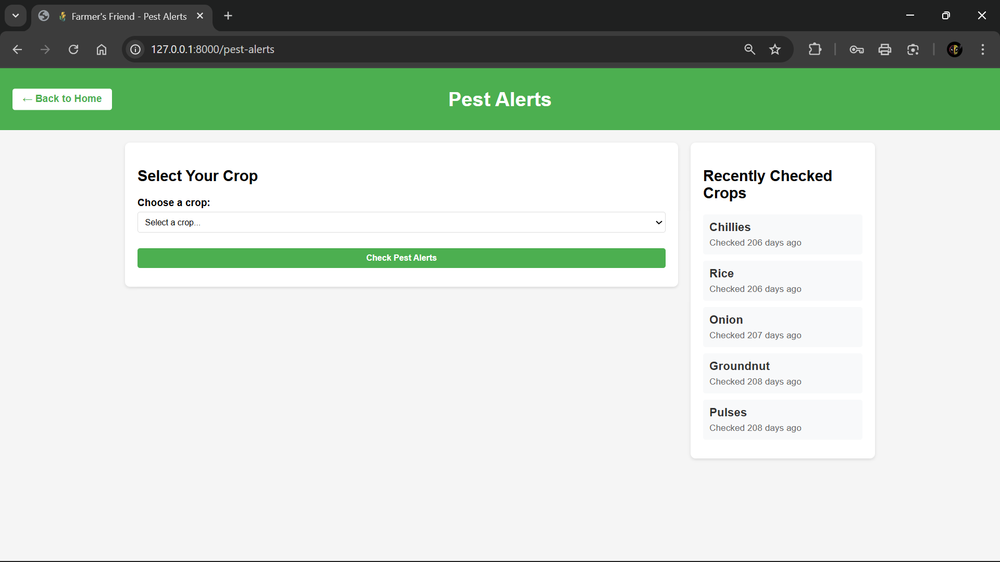
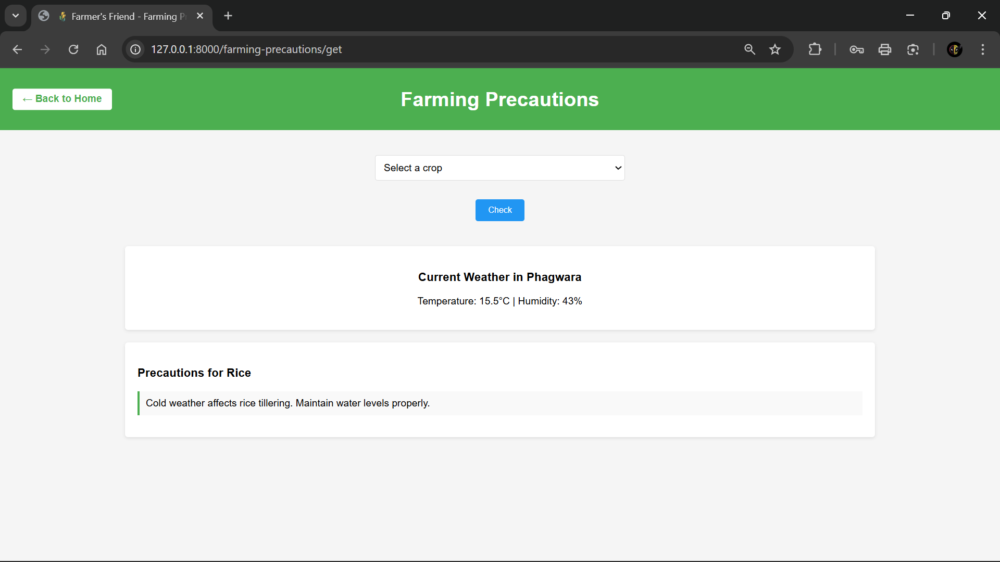

# 🌾 Farmer’s Friend

[](#)

<p align="left">
  
  
  
  
  
  
</p>

A comprehensive **agriculture support system** built with **Laravel** and **Tailwind CSS**, empowering farmers with **real-time weather insights**, **crop recommendations**, **pest alerts**, and **market trends** — all in one intelligent web platform.

---

## 📘 Project Overview

**Farmer’s Friend** is a web platform designed to assist farmers in making informed agricultural decisions.  
It integrates **real-time weather data**, **AI-powered crop recommendations**, **pest alerts**, **farming precautions**, and **market price analytics**, enabling smarter and more sustainable farming.

---

## ✨ Core Features

- 🌦️ **Weather Prediction** — Real-time conditions and 5-day forecasts via OpenWeatherMap API  
- 🌱 **Crop Suggestions** — Smart crop recommendations based on temperature, humidity, and region  
- 🐛 **Pest Alerts** — Disease and pest warnings for 20 major crops with prevention tips  
- ⚠️ **Weather Warnings** — Alerts with severity, urgency, and safety recommendations  
- 💡 **Farming Precautions** — Actionable, weather-based advice for better yield  
- 💰 **Market Prices** — Historical crop prices (2015–2024) for smarter selling decisions  

---

## 🏗️ Technical Architecture

| Layer | Technology |
|--------|-------------|
| **Backend Framework** | Laravel 12.0 (PHP 8.2+) |
| **Frontend** | Blade Templates + Tailwind CSS 4.0 |
| **Build Tool** | Vite 6.2.4 |
| **Database** | SQLite (default), MySQL/PostgreSQL supported |
| **APIs Integrated** | OpenWeatherMap, WeatherAPI.com, Data.gov |
| **Data Handling** | PHPSpreadsheet (CSV/Excel) |
| **Development Tools** | Laravel Sail, Pint, Pest PHP |

---

## 🧩 Project Structure
```
Farmer's Friend/
│
├── app/
│ ├── Console/Commands/
│ ├── Http/Controllers/ # Weather, Crop, Pest, and Market modules
│ ├── Models/
│ ├── Services/ # Business logic and API integrations
│ └── Providers/
│
├── config/ # App configuration files
│
├── database/
│ ├── migrations/ # Tables: users, jobs, crops
│ ├── seeders/
│ └── database.sqlite
│
├── resources/
│ ├── views/ # Blade templates (home, crop, alerts, etc.)
│ ├── css/
│ └── js/
│
├── routes/
│ └── web.php # Web routes
│
├── public/
│ └── crop_price.csv # Market price dataset
│
├── screenshots/ # Project screenshots
└── vite.config.js
```
---

## 🌐 Integrated APIs

| API | Purpose |
|------|----------|
| **OpenWeatherMap** | Real-time weather and forecasts |
| **WeatherAPI.com** | Severe weather alerts and warnings |
| **Data.gov** | Government agricultural datasets |
| **PHPSpreadsheet** | Crop price data (CSV/Excel) |

---
## 🖼️ Screenshots

<details>
<summary>Click to view screenshots</summary>
<br>

### Dashboard


### Weather Prediction


### Weather Warnings


### Crop Suggestions


### Pest Alerts


### Farming Precautions

</details>

---

## ⚙️ Technical Highlights

- 🧠 RESTful API design with Laravel 12  
- 🌩️ Real-time weather integration from multiple sources  
- 🧩 Modular architecture (Service-oriented)  
- 🔒 Scalable, maintainable, and well-structured codebase  
- 🎨 Modern responsive design with Tailwind CSS  
- 🧾 Clean, validated, and formatted PHP code via Laravel Pint  

---

## 🚧 Future Enhancements

- 🔐 User authentication and personalized dashboards  
- 📬 Email/SMS alerts for weather warnings  
- 🤖 Machine learning for adaptive crop prediction  
- 🌎 Multi-language and region support  
- 📱 Mobile app version (React Native/Flutter)  
- 🌾 Marketplace & community forum for farmers  
- 🌤️ IoT-based smart sensor integration  
- 🧮 Advanced analytics, fertilizer, and irrigation scheduling  

---

## 👨‍💻 Author

**Ashutosh Kumar Singh**  
- 🌐 [Portfolio](https://ashutosh-12505.vercel.app/)  
- 💼 [LinkedIn](https://www.linkedin.com/in/ashutosh12505/)  
- 💻 [GitHub](https://github.com/ashutosh12505)

---

<p align="center">
  <i>“Empowering farmers with data-driven insights for a sustainable tomorrow.”</i>
</p>
